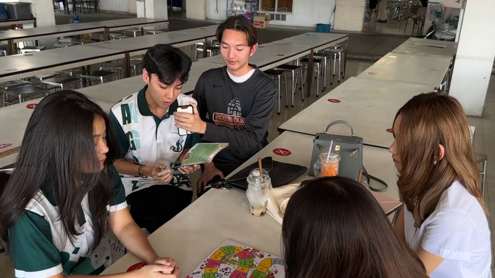

# Cyber Board Game
# By ก๊องV3

วันที่ 7 มกราคม 2568 ที่ผ่านมา ณ บริเวณโรงอาหาร มหาวิทยาลัยเกษตรศาสตร์ วิทยาเขตศรีราชา
"กลุ่มก๊อง V3" ซึ่งเป็นนิสิตจากคณะวิทยาศาสตร์ ศรีราชา สาขาวิทยาการคอมพิวเตอร์ ได้จัดกิจกรรมพิเศษเพื่อส่งเสริมความรู้และความเข้าใจเกี่ยวกับการรักษาความปลอดภัยในโลกไซเบอร์ให้กับนิสิตภายในมหาวิทยาลัย กิจกรรมนี้ใช้ "ไซเบอร์บอร์ดเกม" ซึ่งได้รับการสนับสนุนจากสำนักงานคณะกรรมการการรักษาความมั่นคงปลอดภัยไซเบอร์แห่งชาติ (สกมช.)
ภายในงานมีการเปิดโอกาสให้นิสิตเข้าร่วมเล่นและเรียนรู้ผ่านบอร์ดเกมที่ถูกออกแบบมาอย่างสร้างสรรค์ เพื่อถ่ายทอดเนื้อหาสำคัญเกี่ยวกับการป้องกันภัยคุกคามไซเบอร์ ความเสี่ยงที่อาจเกิดขึ้นในโลกออนไลน์ และแนวทางการจัดการข้อมูลส่วนตัวอย่างปลอดภัย
นอกจากนี้ กิจกรรมดังกล่าวยังช่วยสร้างบรรยากาศการเรียนรู้ที่สนุกสนาน พร้อมทั้งกระตุ้นให้เกิดการแลกเปลี่ยนความรู้ระหว่างผู้เข้าร่วม เป็นอีกหนึ่งกิจกรรมที่มีเป้าหมายเพื่อส่งเสริมความตระหนักรู้เกี่ยวกับความปลอดภัยไซเบอร์

กิจกรรมในครั้งนี้ได้มีคนเข้าร่วมจากนิสิตคณะวิทยาการจัดการ สาขาธุรกิจระหว่างประเทศ 
จุดเด่นของกิจกรรมนี้ คือการเปิดโอกาสให้ทุกคนได้เรียนรู้ถึงความสำคัญของการป้องกันภัยในโลกดิจิทัล ทั้งในมุมมองของเยาวชนและผู้ที่สนใจทั่วไป กิจกรรมครั้งนี้จึงไม่เพียงแต่ให้ความสนุกสนาน แต่ยังสร้างความรู้ความเข้าใจและปลูกฝังจิตสำนึกในการป้องกันภัยทางไซเบอร์ เพื่อให้ผู้เข้าร่วมสามารถนำความรู้ไปปรับใช้ในชีวิตประจำวันได้อย่างมีประสิทธิภาพ

# Member
[6530200525 นายสิทธิกร ประทุมวัน](https://6530200525.github.io/boardgame)

[6530200088 นายชลสิทธิ์ กิจกุลพิเชฐ](https://markchonlasit.github.io/chonlasitK.github.io/boardgame)

[6530200835 สรสิช ปัญญางค์](https://bossmahob.github.io/cyberboardgame)

[6530250166 พิชานัต พรหมณี](https://naieric.github.io/cyberboardgame.html)
